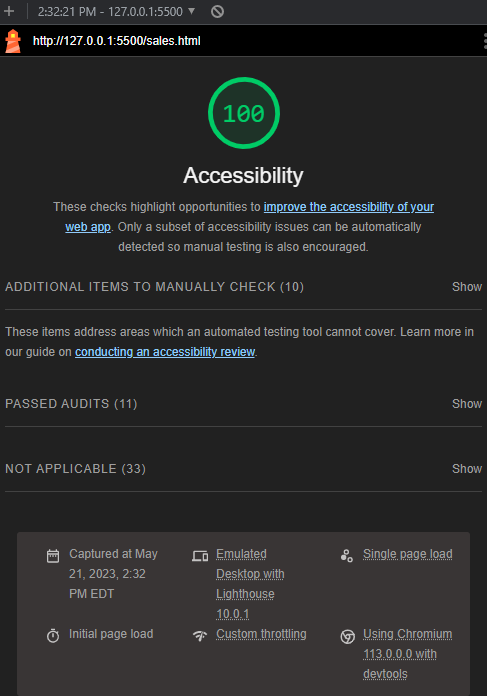

# Salmon Cookies Lab - Code Fellows 201

## Salmon Cookies

This lab builds a frontend homepage and sales-data page for a company that produces randomly generated
simulation data so we can develop a page for customers and a page for the business to aggregate data/info.

___

### Author: Jonathon Stillson

___

### Lab 09 Lighthouse

___

### Labs covered by this Repository

CF 201 Labs: Class 06, Class 07, Class 8b, Class 09, Class 10b
